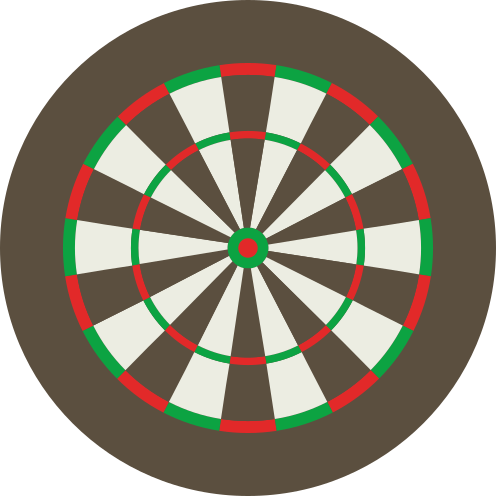

<p align="center">
  <a href="https://darts-scorer.vercel.app/" target="blank"></a>
</p>

<p align="center" ><b>Dart Scorer App</b>, la aplicación de dardos.</p>

<p align="center">
    <a href="https://www.npmjs.com/~nestjscore" target="_blank"></a>
    <a href="https://www.npmjs.com/~nestjscore" target="_blank"></a>
</p>

<br/>

# Darts-Scorer
App that allows you to mantain a record of a game of darts in some modalities (301, 501, Cricket...) to keep a record on the scores and check how you doing in the game.


<br/>

# Installation

```javascript
 $ git clone 'https://github.com/DavidFFDAW/Darts-Scorer.git'
 $ cd Darts-Scorer
 $ rm -rf .git
 $ cd frontend
 $ npm install
 $ npm start

```
<br/>

# License

This project is licensed under the MIT license and so it is as it is and the author has no responsibility over it.

<br/>
<br/>

# Author

 -  David Fernandez Flores
